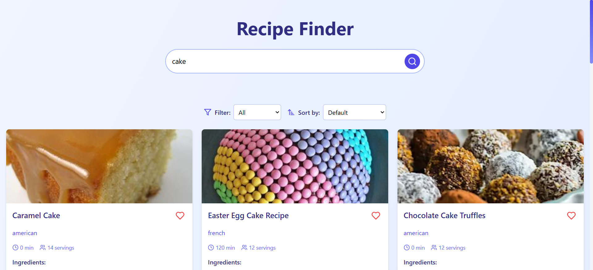

# Recipe Finder

### Une application pour rechercher et gérer vos recettes favorites

---

## Table des matières

- [Aperçu](#aperçu)
- [Fonctionnalités](#fonctionnalités)
- [Technologies](#technologies)
- [Déploiement](#déploiement)
- [Auteur](#auteur)

---

## Aperçu

**Recipe Finder** est une application intuitive permettant de rechercher des recettes en fonction des ingrédients ou des mots-clés. Vous pouvez filtrer, trier et ajouter des recettes à vos favoris. L'interface est moderne et responsive, offrant une expérience agréable sur tous les appareils.

### Aperçu visuel

#### Desktop View

---

## Fonctionnalités

- **Recherche de recettes** :
  - Saisissez un ingrédient ou un mot-clé pour trouver des recettes correspondantes.
- **Filtrage et tri** :
  - Filtrer par préférences alimentaires (végétarien, sans gluten, etc.).
  - Trier par popularité ou par temps de préparation.
- **Favoris** :
  - Ajouter des recettes à vos favoris.
  - Stockage local des favoris pour les retrouver entre les sessions.
- **Responsive Design** :
  - Adapté à tous les types d'appareils (desktop, tablette, mobile).
- **Animations** :
  - Utilisation de **Framer Motion** pour des animations fluides et dynamiques.

---

## Technologies

- **React.js** : Framework JavaScript pour créer une interface utilisateur interactive.
- **Tailwind CSS** : Utilisé pour un design rapide et flexible.
- **Framer Motion** : Pour les animations modernes et élégantes.
- **Edamam Recipe API** : Source pour les données des recettes.
- **Lucide Icons** : Icônes modernes et accessibles.

---

## Déploiement

L'application est déployée sur [Recipe Finder](https://elgargati.github.io/Recettes/).

---

## Auteur

- **Mohammed El Gargati**
- GitHub : [Elgargati](https://github.com/Elgargati)

---

N'hésitez pas à me contacter si vous avez des questions ou des suggestions !
